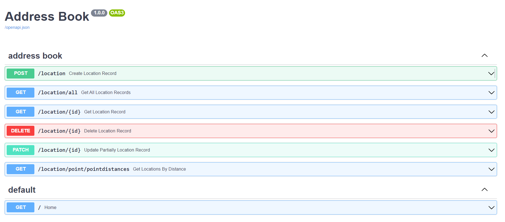
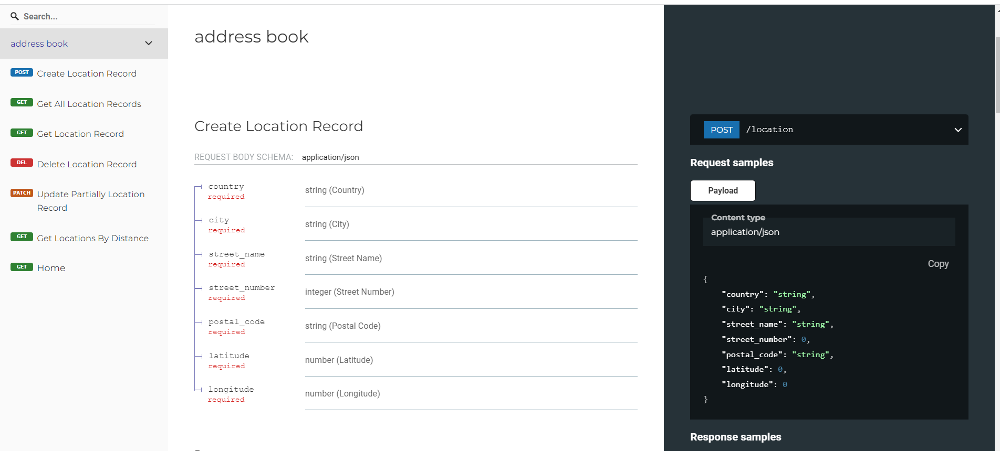

# ADDRESS BOOK

## Description
Address book is a minimal API for demonstration purposes where API users can create, update and delete addresses. As an additional feature search by current position and distance is included. 


## Installation
### Clone the repository
1. Copy the link from Github Repository.
2. Change the current working directory to the location where you want the cloned directory.
3. Open GitBash and clone repository

```bash
$ git clone https://github.com/ivklisurova/FASTAPI-address-book.git
```
### Project Setup

1. In terminal use following commands to run the app 

```bash
pip install -r requirements.txt
```
2. To run the app server execute in terminal
```bash
uvicorn main:app --reload
```

## Usage

## Interactive API docs


Now go to http://127.0.0.1:8000/docs.

You will see the automatic interactive API documentation (provided by Swagger UI):



## Alternative API docs
And now, go to http://127.0.0.1:8000/redoc.

You will see the alternative automatic documentation (provided by ReDoc):
